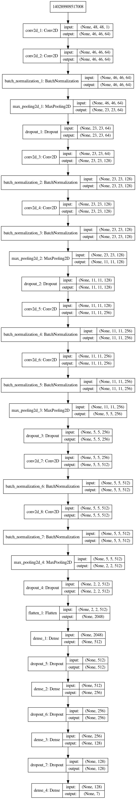

<!-- PROJECT SHIELDS -->
<!--
*** I'm using markdown "reference style" links for readability.
*** Reference links are enclosed in brackets [ ] instead of parentheses ( ).
*** See the bottom of this document for the declaration of the reference variables
*** for contributors-url, forks-url, etc. This is an optional, concise syntax you may use.
*** https://www.markdownguide.org/basic-syntax/#reference-style-links
-->

<!-- PROJECT LOGO -->
<p align="center">
  <a href="https://github.com/github_username/repo">
    
  </a>

  <h3 align="center">Image Processing API</h3>

  <p align="center">
    a python based image processing api
  </p>
</p>


<!-- ABOUT THE PROJECT -->

## About The Project


A python based image processing api.


### Built With

* [Flask](https://github.com/pallets/flask)
* [Tensorflow](https://github.com/tensorflow/tensorflow)
* [Keras](https://github.com/keras-team/keras)
* [dlib](https://github.com/davisking/dlib)
* [OpenCV](https://github.com/opencv/opencv)
* [numpy](https://github.com/numpy/numpy)
* [matplotlib](https://github.com/matplotlib/matplotlib)

<!-- GETTING STARTED -->
## Getting Started

To get a local copy up and running follow these simple steps.

### Prerequisites

#### Running locally
* Install de [dependencies](requirements.txt)
* Run ``` python server.py ``` 
  
#### Running locally with Docker

* Build ``` docker build . -t image-processing-api```
* Run ``` docker run -p 8080:8080 image-processing-api ```

#### Running with Dockerhub 
``` docker run -d -p 8080:8080 alissonsteffens/python-flask-opencv-dlib ```

## Usage
POST to ```localhost:8080/api/landmarks``` *send the image as base64 in the request body*

### Endpoints

#### Knowledge APi
* /api/landmarks
* /api/emotion

#### Edit Image
* /grayscale
* /negative
* /thumb
* /sketch


## Academic

### Emotion Recognition Network

The CNN model is


